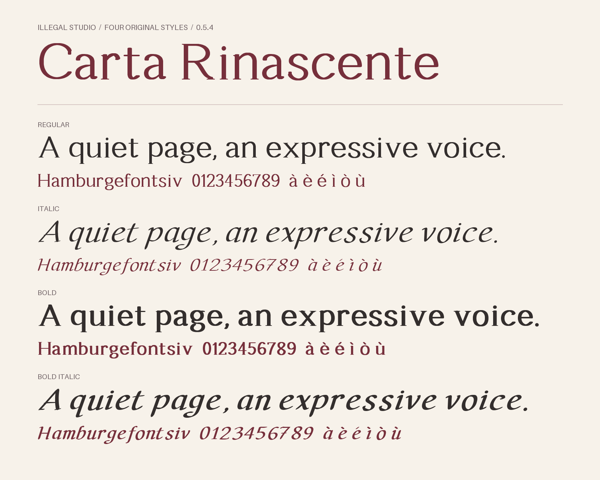

<p align="center">
  
</p>

<h1 align="center">Carta Rinascente</h1>

<p align="center">
  <em>A new typeface with an old soul.</em>
</p>

<p align="center">
  <a href="dist/metadata.json"></a>
  <a href="OFL.txt"></a>
  <a href="#get-the-font"></a>
</p>

<p align="center">
  <strong>340 characters per style &middot; Four styles &middot; TTF + WOFF2 &middot; Open source</strong>
</p>

<p align="center">
  An original typeface inspired by Renaissance penmanship, created for inclusion among the default fonts in Ariadne, the writing software by illegal studio. A composed upright design and an expressive italic bring the warmth of ink on paper to titles, quotations and short passages.
</p>

<p align="center">
  <a href="https://illegal.studio"><strong>illegal studio</strong></a>
  &middot;
  <a href="https://illegal.studio/en/products/ariadne"><strong>Discover Ariadne</strong></a>
</p>

---

<p align="center">
  
</p>

## Made for Ariadne

Carta Rinascente was created to join the default font selection in [Ariadne](https://illegal.studio/en/products/ariadne), the writing software by [illegal studio](https://illegal.studio). The goal is to give writers a distinctive typographic voice for titles, quotations and short passages, with a design that recalls the movement of a pen.

The font is also available on its own, ready to use in your documents, websites and applications.

## Get the font

The ready-to-use files are included in this repository. No build is required. Packaged editions are published on [GitHub Releases](https://github.com/illegalstudio/carta-rinascente/releases).

| Style | Desktop / native | Web |
| --- | --- | --- |
| Regular | [TTF](dist/CartaRinascente-Regular.ttf) | [WOFF2](dist/CartaRinascente-Regular.woff2) |
| Italic | [TTF](dist/CartaRinascente-Italic.ttf) | [WOFF2](dist/CartaRinascente-Italic.woff2) |
| Bold | [TTF](dist/CartaRinascente-Bold.ttf) | [WOFF2](dist/CartaRinascente-Bold.woff2) |
| Bold Italic | [TTF](dist/CartaRinascente-BoldItalic.ttf) | [WOFF2](dist/CartaRinascente-BoldItalic.woff2) |

Install all four TTF files with your operating system's font manager, then select **Carta Rinascente**. The fonts share a family name and carry the style flags used by applications for bold and italic selection. Include [`OFL.txt`](OFL.txt) when redistributing them; a copy is also supplied in `dist/`.

For native app bundles, register all four TTF files through the platform's font asset system. Their PostScript names follow `CartaRinascente-Regular`, `CartaRinascente-Italic`, `CartaRinascente-Bold` and `CartaRinascente-BoldItalic`.

To try the interactive preview, download or clone the repository and open `index.html` locally, keeping `dist/` beside it.

## Use on the web

Copy all four WOFF2 files and `OFL.txt` into your project, then adjust the URLs:

```css
@font-face {
  font-family: "Carta Rinascente";
  src: url("/fonts/CartaRinascente-Regular.woff2") format("woff2");
  font-weight: 400;
  font-style: normal;
  font-display: swap;
}

@font-face {
  font-family: "Carta Rinascente";
  src: url("/fonts/CartaRinascente-Italic.woff2") format("woff2");
  font-weight: 400;
  font-style: italic;
  font-display: swap;
}

@font-face {
  font-family: "Carta Rinascente";
  src: url("/fonts/CartaRinascente-Bold.woff2") format("woff2");
  font-weight: 700;
  font-style: normal;
  font-display: swap;
}

@font-face {
  font-family: "Carta Rinascente";
  src: url("/fonts/CartaRinascente-BoldItalic.woff2") format("woff2");
  font-weight: 700;
  font-style: italic;
  font-display: swap;
}

.writing {
  font-family: "Carta Rinascente", serif;
  font-synthesis: none;
  line-height: 1.4;
}
```

Use normal CSS `font-weight` and `font-style` to select a face. Regular and Bold are upright, with open proportions, bracketed serifs and steady strokes. Italic and Bold Italic use a 13-degree design slant, curved ascenders, sweeping descenders and tapered exit strokes. Their broader letterforms occupy approximately the same horizontal space as their upright companions. Optical spacing lets flourishes extend beyond the lowercase body without separating the words. Shared vertical metrics keep line spacing consistent when styles are mixed.

## Character and coverage

- **340 encoded characters and 341 glyphs per style**, including the missing-character glyph.
- **Complete printable Basic Latin and Latin-1 coverage**, Italian accents, many Latin Extended-A characters, combining marks, the euro symbol and typographic punctuation.
- **Proportional spacing and numerals**, with style-specific kerning, combining-mark positioning, contextual dot removal for accented i and j, and conventional comma forms in ď, ľ, ť and ģ.
- **Four linked styles**, version 0.5.4: Regular, Italic, Bold and Bold Italic, each supplied as TTF and WOFF2.

This experimental family is intended for headings and short passages. The reading proof shows all four styles at exactly 18, 24, 36 and 48 px, using “The art of a quiet page.” without automatic resizing. Inspect it at 100% zoom and check the result in your target application. Dedicated ligatures, stacked-mark positioning and manual TrueType hinting are not included. Greek, Cyrillic and emoji are outside the current character set.

Browse the [full character metadata](dist/metadata.json), [character sheet](dist/caratteri.png), [reading and spacing tests](dist/prove-lettura.png), [letterform details](dist/prove-forme.png), [stroke balance](dist/prove-spessori.png), [dots and punctuation](dist/prove-punteggiatura.png) or [four-style family specimen](dist/anteprima.png).

## Inspiration and originality

Carta Rinascente was inspired by **Michelangelus**, the typeface introduced by Microsoft and inspired by Michelangelo's work and handwritten manuscripts. Commissioned by the Fabbrica di San Pietro and designed by Studiogusto, the project explores how Renaissance letterforms can inform contemporary typography. Read the official [Microsoft Design story, *Designing Michelangelus*](https://microsoft.design/articles/designing-michelangelus/), or visit the [Microsoft Michelangelus download page](https://www.microsoft.com/en-us/download/details.aspx?id=108856).

That idea prompted our own experiment with the rhythm of a pen on paper. Carta Rinascente's glyphs are built from independent pen paths and closed contours in [`src/design/`](src/design). No outlines, metrics or traced letterforms from Michelangelus or other proprietary fonts are copied into the design, and no external font files are required to build it. It is an independent project, unaffiliated with Microsoft, Studiogusto or the Fabbrica di San Pietro, and does not claim to reconstruct Michelangelo's handwriting.

## Build from source

The toolchain is verified with **Python 3.14**. Dependencies are pinned in [`requirements.txt`](requirements.txt).

```bash
python -m venv .venv
.venv/bin/python -m pip install -r requirements.txt
.venv/bin/python -m src all
```

One command builds all eight font files, validates the family, copies the license and renders the English specimens. It also refreshes the README specimen when using the default `dist/` output. No external input font is required.

For focused work:

```bash
.venv/bin/python -m src build
.venv/bin/python -m src specimen
.venv/bin/python -m src validate
.venv/bin/python -m unittest discover -s tests -v
.venv/bin/python -m src all --check-reproducible
```

Each command accepts `--output PATH`. The specimen commands also accept `--readme-output PATH`. On Windows, use `.venv\Scripts\python.exe` in place of `.venv/bin/python`.

The original `build_font.py`, `render_specimen.py` and `validate_font.py` commands remain available as thin wrappers around the package.

### Source layout

| Module | Responsibility |
| --- | --- |
| [`config.py`](src/config.py) | Immutable style definitions, family names and shared metrics |
| [`design/`](src/design) | Original Latin, roman, italic, symbol and accent paths; optical kerning pairs |
| [`geometry.py`](src/geometry.py) | Strict path parsing, pen pressure, round dots, contour refinement, body scaling and per-style state |
| [`composition.py`](src/composition.py) | Extended Latin, accents, fractions, punctuation and whitespace |
| [`anchors.py`](src/anchors.py) | Shared anchors for composed accents and OpenType positioning |
| [`outlines.py`](src/outlines.py) | TrueType contours and winding |
| [`features.py`](src/features.py) | Kerning, contextual accents, dot removal and mark positioning |
| [`build.py`](src/build.py) | Staged compilation, style linking and TTF/WOFF2 export |
| [`validation.py`](src/validation.py) | Exported-font checks using FontTools, FreeType and HarfBuzz |
| [`specimens.py`](src/specimens.py) | Reproducible family, individual-style, character, reading and detail proofs |
| [`cli.py`](src/cli.py) | Shared command-line interface |
| [`versioning.py`](src/versioning.py) | SemVer parsing, OpenType revision and version labels |
| [`distribution.py`](src/distribution.py) | Validated, reproducible release ZIP and checksums |
| [`release.py`](src/release.py) | Interactive preflight, isolated preparation and atomic tag push |

The upright styles have dedicated uppercase, lowercase and lining numeral designs, including a double-storey a and g. A level pen, steady stems and curved serif brackets keep the roman composed. Small corner rounding softens abrupt joins without changing the advances; an angled pen and dedicated italic paths give the cursive its contrasting rhythm. Bold styles use a heavier pen during geometry construction. All builds use isolated glyph state, fixed timestamps and deterministic glyph ordering.

Individual pen strokes can set their nib depth and a smooth pressure profile along the path. Fuller shoulders support n, m, h and r without widening their stems. Pressure eases locally where branches meet stems and bowls return to their stems, reducing dark junctions in a, u and related forms. Left-stem bowls retain fuller lower hairlines. Pressure positions and eased terminal tapers follow traveled distance, avoiding abrupt changes at the ends of italic strokes. Roman stems finish inside their serifs to keep the feet level at both weights. Accented letters and related Latin forms inherit the same corrections. Validation checks connected strokes and intact counters after TrueType quantization.

The design is drawn on a 900-unit grid and exported at 1000 units per em. Outlines, spacing, kerning and mark positions are scaled together. The lowercase body reaches approximately 56% of the em. Wider roman counters and fuller strokes give the family more presence at the same font size; the italic body is enlarged without extending its ascenders or descenders.

Italic paths are widened before the pen is swept along them, preserving the nib's stroke weight and vertical dimensions. Explicit advances and optical overhang corrections follow the same horizontal scale. This gives the cursive more room while preserving its spacing rhythm.

Compilation and validation happen in a temporary staging directory before the released font files are replaced. Temporary build directories are cleaned on success and failure. Pillow's built-in font supplies only the specimen labels; every displayed Carta Rinascente glyph comes from this project's generated TTF files.

### Validation

The validator checks every style's character coverage, nonempty contours, vertical bounds, naming and style flags, embedding permissions, zero-width combining marks, NFC/NFD equivalence, contextual dot removal, kerning, mark positioning, unintended overlap in all 676 Basic Latin lowercase pairs and representative uppercase pairs, 1,248 letter/punctuation pairs, FreeType rasterization at 18, 24 and 64 px, and TTF/WOFF2 outline and shaping equivalence. The [validation report](dist/validation.json) records all eight SHA-256 hashes.

Seven neutral samples also compare each italic's shaped width with its upright companion. The reference phrase is required to be equal or up to 3% wider in italic; other samples allow natural variation between letterforms. Exact line breaks can still differ between styles.

The unit tests cover malformed paths and filled contours, local stroke pressure and hairline depth, open counters, corner refinement, round dots, italic body scaling, isolated style state, explicit zero advances, shared accent anchors, contextual accent clearance, accented and punctuation kerning pairs, and safe handling of failed builds. `--check-reproducible` compares every font and manifest against a second clean build.

The generated proofs and the browser preview have been visually checked. Integration in Ariadne and other native applications still needs verification in the target product.

## Create a GitHub release

Use Python 3.14, Git and Make. Your `origin` remote must point to the GitHub repository with matching fetch and push URLs, and your Git credentials must allow pushing to it. GitHub Actions must be enabled.

```bash
make setup              # Create .venv and install the pinned dependencies
make check              # Unit tests, full build, validation and reproducibility
make release-dry-run    # Read-only preflight and proposed version
make release            # Interactive version selection and confirmation
```

Start on a clean `main` branch, with your changes committed and pushed. Like the release command in [ggw](https://github.com/illegalstudio/ggw), `make release` proposes a version and asks for confirmation. You can accept the proposal or enter another stable `MAJOR.MINOR.PATCH` version, with or without a `v` prefix. The first release uses the current source version; subsequent releases default to the next patch, unless the source already has a newer version. Prerelease and build suffixes are not supported yet.

After confirmation, the command builds from a temporary copy of the committed source, runs the tests, validates all four styles and checks byte reproducibility. It updates the source version, README, preview, fonts and specimens, creates a release commit if needed, then creates an annotated tag. An atomic push sends `main` and the tag together. A failed preparation leaves the original checkout untouched.

The [Release workflow](.github/workflows/release.yml) also checks every push to `main`. For a version tag, it rebuilds and compares the generated files, then publishes the GitHub release with generated release notes, all eight TTF/WOFF2 files, a family ZIP and `SHA256SUMS`. The ZIP includes the license, version and validation metadata, and installation instructions. GitHub supplies the tagged source archives separately.

To create the same assets locally without publishing:

```bash
make package
# Output: build/release/<version>/
```

The generated release directory is ignored by Git. If a push fails, the local release commit and tag are retained; the command prints the exact push command to retry. If GitHub's build fails, inspect its logs before publishing anything manually. A failed asset upload can leave a draft release, which should be reviewed and completed or removed before rerunning publication.

### Versioning

Project versions and GitHub tags use SemVer. Patch releases fix defects; minor releases add glyphs, features or design revisions while the family is below 1.0. After 1.0, incompatible changes to family names, coverage or layout belong in a major release.

OpenType also stores a numeric font revision, which cannot encode three semantic components. [`src/__init__.py`](src/__init__.py) holds both values. `make release` increments the internal revision by 0.001 when it advances the project version, independently of the SemVer component being changed. The full SemVer remains in the font's name table and JSON metadata. This follows the [OpenType revision format](https://learn.microsoft.com/en-us/typography/opentype/spec/recom#head-table) while keeping GitHub releases consistent with other software projects.

## License and credits

The font, source and documentation are distributed under the **SIL Open Font License 1.1**, with no Reserved Font Names. See [`OFL.txt`](OFL.txt) for the complete terms.

The license permits use, modification and embedding in commercial applications. Keep the copyright notice and license with redistributed font files. Modified font versions remain under the OFL, and the font may not be sold by itself. Build dependencies retain their respective licenses.

Created by nahime at [illegal studio](https://illegal.studio), with assistance from OpenAI Codex. First edition: October 2026.
